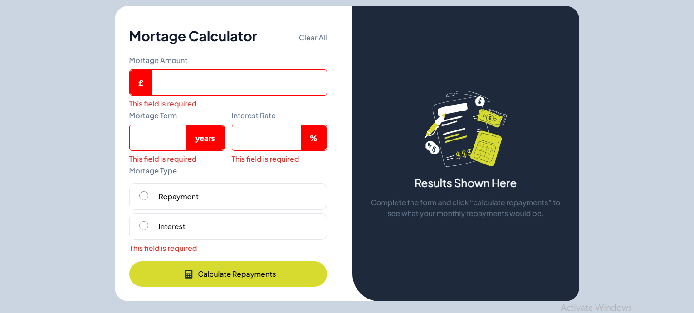

# Frontend Mentor - Mortgage repayment calculator solution

This is a solution to the [Mortgage repayment calculator challenge on Frontend Mentor](https://www.frontendmentor.io/challenges/mortgage-repayment-calculator-Galx1LXK73). Frontend Mentor challenges help you improve your coding skills by building realistic projects.

## Table of contents

- [Overview](#overview)
  - [The challenge](#the-challenge)
  - [Screenshot](#screenshot)
  - [Links](#links)
- [My process](#my-process)
  - [Built with](#built-with)
  - [What I learned](#what-i-learned)
  - [Continued development](#continued-development)
  - [Useful resources](#useful-resources)
- [Author](#author)

## Overview

### The challenge

Users should be able to:

- Input mortgage information and see monthly repayment and total repayment amounts after submitting the form
- See form validation messages if any field is incomplete
- Complete the form only using their keyboard
- View the optimal layout for the interface depending on their device's screen size
- See hover and focus states for all interactive elements on the page

### Screenshot



### Links

- Solution URL: [Add live site URL here](https://your-live-site-url.com)
- Live Site URL: [https://mortage-calculator-fm.vercel.app/](https://mortage-calculator-fm.vercel.app/)

## My process

### Built with

- Semantic HTML5 markup
- CSS custom properties
- Flexbox
- CSS Grid
- Mobile-first workflow
- [Vue](https://vuejs.org/) - JS library
- [Pinia](https://pinia.vuejs.org/) - State Management Library for Vue
- [Tailwind CSS](https://tailwindCSS.com/) - For styles

### What I learned

This was a challenge to get more comfortable with vue. I learnt a few things about vue, but was mainly trying to get the validation from HTML done without actually using any Javascript. Overall I mainly got better in using vue.

Props that I used for my enhancedInput component, the align property is so the enhanced text can be aligned to the left or the right of the input element.

```typescript
defineProps<{
  label: string
  text: string
  align: 'left' | 'right'
  name: keyof Mortage
  min: number
}>()
```

```html
<span
  class="..."
  :class="{
    'left-[1px] rounded-l-md': align == 'left',
    'right-[1px] rounded-r-md': align == 'right',
  }"
  >{{ text }}</span
>
```

```css
input:not([type='radio']):invalid {
  border: 1px solid red;

  & ~ span {
    background-color: red;
    color: white;
  }

  & ~ .error {
    display: block;
  }
}
```

```js
const calculateMortage = () => {
  const { amount, duration, interest, type } = formInfo.value
  const monthlyRate = interest / 100 / 12

  const num_payments = duration * 12
  let monthlyPayment = 0,
    totalPayment = 0

  if (type == 'repayment') {
    monthlyPayment =
      (amount * (monthlyRate * Math.pow(1 + monthlyRate, num_payments))) /
      (Math.pow(1 + monthlyRate, num_payments) - 1)

    totalPayment = monthlyPayment * num_payments
  } else if (type == 'interest') {
    monthlyPayment = monthlyRate * amount
    totalPayment = monthlyPayment * num_payments + amount
  }

  console.log('Calculating...')
  mortgageValues.monthlyPayment = monthlyPayment
  mortgageValues.totalPayment = totalPayment
  return {
    totalPayment,
    monthlyPayment
  }
}
```

### Continued development

There is still a few things that can be updated in this code, as always I need to refactor the code. I might also put in a few tests to make sure it works. There is an issue with the validation because I tried to use HTML and CSS for the validation like using pseudo-classes like :invalid but it's not working as expected so I might just have to use my own custom validations fir it.

### Useful resources

- [VueJS](https://vuejs.org) - Official Vue Documentation
- [TailwindCSS](https://tailwindCSS.com) - TailwindCSS documentation
  hen you look back on this project in the future.\*\*

## Author

- Website - [Github Repo](https://github.com/dylan-dot-c)
- Frontend Mentor - [@dylandotc](https://www.frontendmentor.io/profile/dylandotc)
